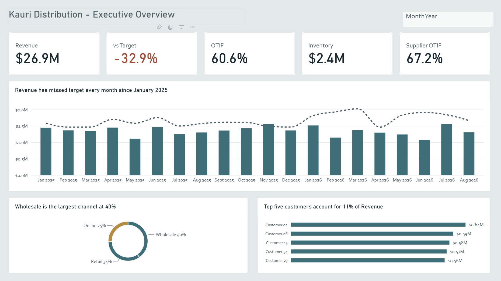
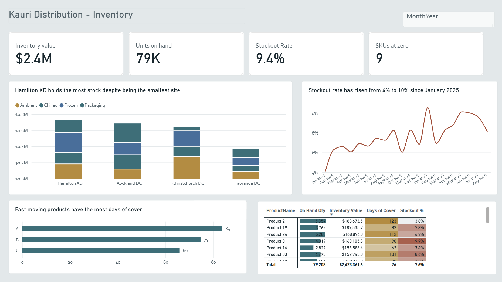
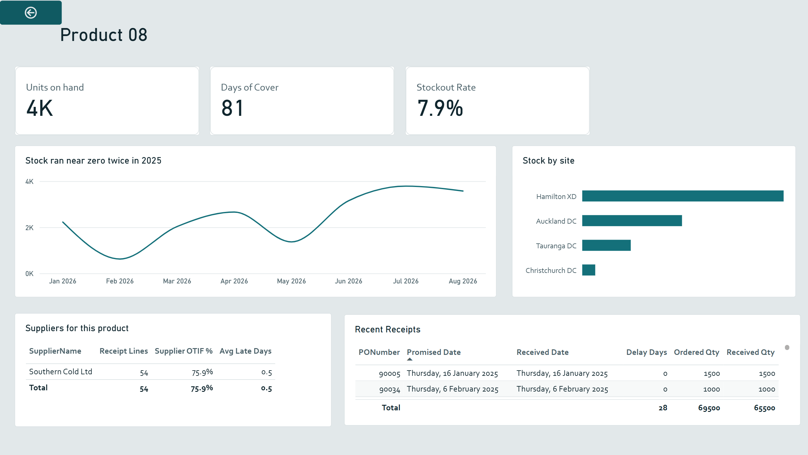
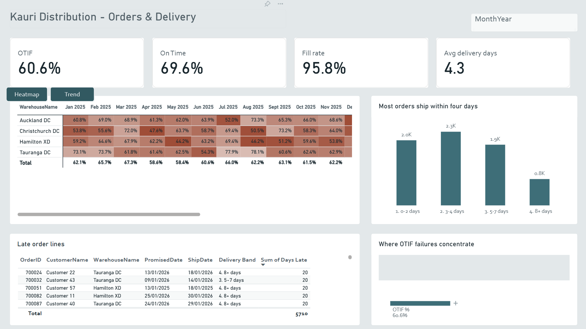
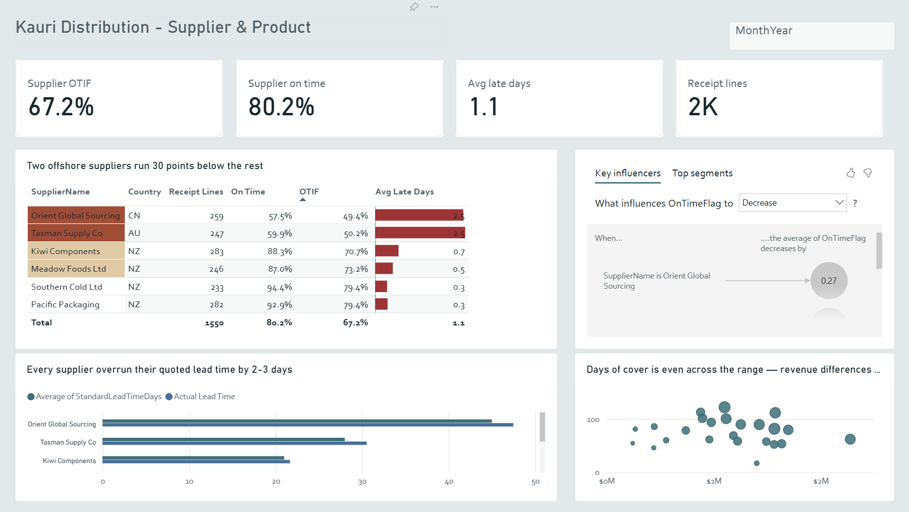

# Supply Chain Performance Analytics — Power BI

An end-to-end Power BI solution for **Kauri Distribution**, a simulated New Zealand food and packaging distributor running four distribution centres, six suppliers and 60 customers across three sales channels.

Built from nine raw source files through to a published, secured report covering sales performance, inventory health, delivery service and supplier reliability.

> The dataset is synthetic and was generated for this project. The business, suppliers and customers are fictional. The modelling decisions, metrics and analysis are the work.

\---

## What the report found

Three problems surfaced in the data:

|Finding|Detail|
|-|-|
|**Revenue missed target every month**|20 consecutive months, averaging 33% below plan|
|**Stockouts more than doubled**|4% to 10% of SKU-days, while inventory value stayed flat|
|**Two suppliers run 30 points below the rest**|Offshore suppliers at \~58% OTIF against 87–94% domestic|

The service diagnosis is the one that matters operationally: **fill rate is 95.8% but on-time delivery is 69.6%**. Orders are being shipped complete — just late. That points at scheduling and transport, not stock availability, which is a different team and a different fix.

\---



## Architecture

Star schema. Four fact tables at three different grains, sharing six conformed dimensions. No fact-to-fact relationships.

```
                    DimDate
                       │
  DimCustomer ─── FactOrders ─── DimProduct
                       │
                 DimWarehouse ─── DimChannel

  DimDate ──┐
  DimProduct├── FactInventory ─── DimWarehouse
            │
  DimDate ──┐
  DimSupplier── FactPurchaseReceipts ─── DimProduct
            │
  DimDate ─── FactTargets ─── DimWarehouse / DimChannel
```

### Grain

|Table|Rows|Grain|
|-|-|-|
|FactOrders|7,075|one row per order line|
|FactInventory|41,664|one row per SKU / warehouse / business day|
|FactPurchaseReceipts|1,550|one row per PO line|
|FactTargets|288|one row per warehouse / channel / month|
|DimDate|730|one row per date, built in DAX|

\---

## Technical detail

### Data preparation (Power Query)

Nine source files, \~50,000 rows. Eleven data-quality defects were identified and resolved:

* A duplicated order line sitting 4,000 rows from its twin — found with a Group By grain test, invisible to column profiling
* A duplicate key in DimProduct caused by storing supplier at the wrong grain
* Case-inconsistent join keys (Power Query is case-sensitive; the model is not)
* Currency stored as text, producing silent error cells
* `dd/mm/yyyy` dates misparsed under a US locale — 40% errored visibly, 60% converted silently and wrongly

Also: append across year files, `Unpivot Other Columns` on a wide targets sheet, staging queries disabled from load, types set last and dates typed with explicit NZ locale.

### Modelling

* Role-playing date dimension — three relationships from FactOrders to DimDate, two inactive, switched with `USERELATIONSHIP`
* Mixed-grain targets resolved in DAX with `TREATAS` rather than fabricating daily rows
* `DimChannel` added as a conformed dimension so targets and actuals can be compared by channel
* Row-level security, static and dynamic, using `USERPRINCIPALNAME()` against a hidden mapping table
* Single-direction filtering throughout; bi-directional tested deliberately and removed

### DAX

Around 35 measures. The ones worth reading:

**Semi-additive inventory** — daily snapshots cannot be summed across time. `SUM(OnHandQty)` returned 40.7M units against an actual position of 79,208.

```dax
On Hand Qty =
CALCULATE(
    SUM(FactInventory\\\\\\\[OnHandQty]),
    LASTNONBLANK(DimDate\\\\\\\[Date], CALCULATE(SUM(FactInventory\\\\\\\[OnHandQty])))
)
```

`LASTNONBLANK` rather than `LASTDATE` because the fact table holds weekdays only — month ends falling on a weekend returned blank.

**Grain translation** — monthly targets against a daily date table:

```dax
Target Revenue =
CALCULATE(
    SUM(FactTargets\\\\\\\[TargetRevenue]),
    REMOVEFILTERS(DimDate),
    TREATAS(VALUES(DimDate\\\\\\\[YearMonth]), FactTargets\\\\\\\[YearMonth])
)
```

**Service metrics** — OTIF requires a row-level comparison of two columns, so `FILTER` is required rather than a boolean filter argument:

```dax
OTIF % =
DIVIDE(
    CALCULATE(
        COUNTROWS(FactOrders),
        FILTER(
            FactOrders,
            FactOrders\\\\\\\[ShipDate] <= FactOrders\\\\\\\[PromisedDate]
            \\\\\\\&\\\\\\\& FactOrders\\\\\\\[QtyShipped] >= FactOrders\\\\\\\[QtyOrdered]
        )
    ),
    COUNTROWS(FactOrders)
)
```

### Report

Four pages plus a hidden drillthrough page.

1. **Executive Overview** — five KPIs chained from supplier reliability through to revenue against target


2. **Inventory** — value by site and temperature band, stockout trend, days of cover by ABC class, SKU matrix with drillthrough




3. **Orders \& Delivery** — OTIF heatmap by site and month, delivery-time distribution, late-lines detail, decomposition tree


4. **Supplier \& Product** — scorecard with rule-based conditional formatting, key influencers, lead-time variance


Features used: drillthrough, bookmarks with button navigation, report-page tooltips, a what-if parameter, synced slicers, three types of conditional formatting, alt text on every visual, defined tab order, and mobile layouts.

### Deployment

Published to a Power BI workspace with RLS assigned and tested, an app with audiences, a dashboard with a data alert, incremental refresh configured on FactInventory (2-year archive, 1-month refresh window), and a second thin report built against the shared semantic model.

\---

## Design

The colour system is derived from the subject rather than a palette generator. Product categories map to cold-chain temperature bands, so anyone from the industry reads the charts without consulting a legend:

|Category|Colour||
|-|-|-|
|Frozen|`#2E6F9E`|cold blue|
|Chilled|`#14707A`|petrol teal|
|Ambient|`#C08A2E`|warm amber|
|Packaging|`#8A6A4F`|kraft|

Typography is DIN for figures and headings — an industrial face originally drawn for German technical standards — with a humanist sans for body text. Chart titles state findings rather than describing axes.

The theme is included as `theme/KauriColdChain.json`.

\---

## Repository contents

```
├── data/                   nine synthetic source files
├── pbix/                   Power BI Desktop file
├── theme/                  custom report theme (JSON)
├── screenshots/            report pages
└── docs/                   data dictionary and modelling notes
```

\---

## Running it

1. Clone the repo
2. Open `pbix/KauriDistribution\\\\\\\_Sales.pbix` in Power BI Desktop
3. Transform data → Data source settings → repoint the queries to your local `data/` folder
4. Close \& Apply

The file paths are absolute and will need updating — which is itself the reason Data source settings exists.

